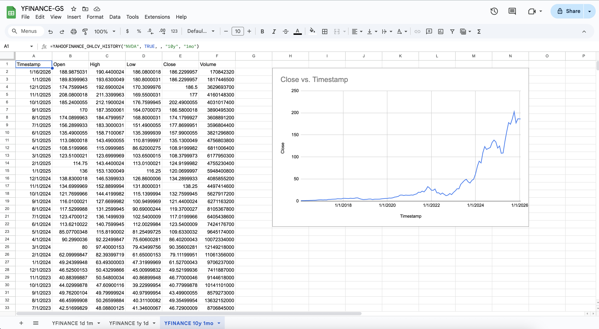
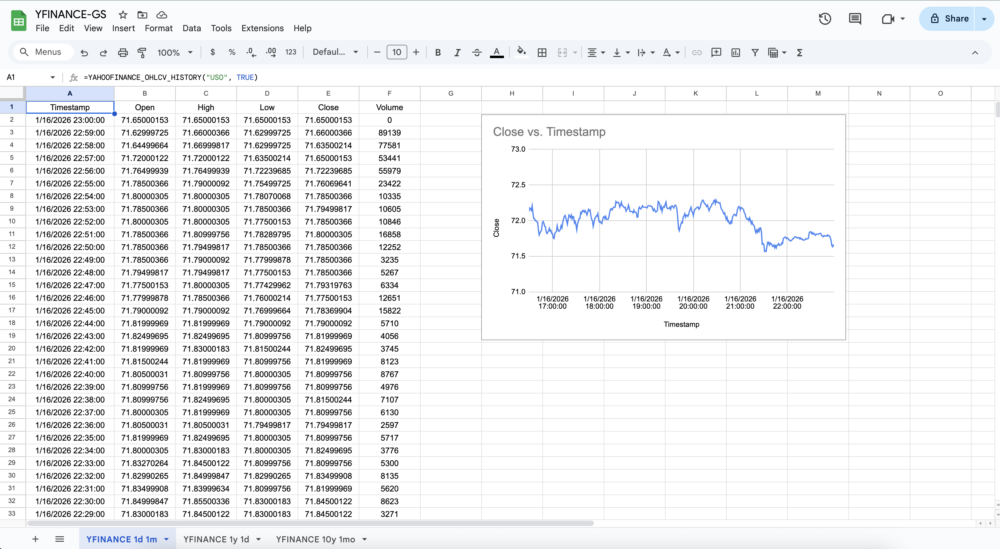
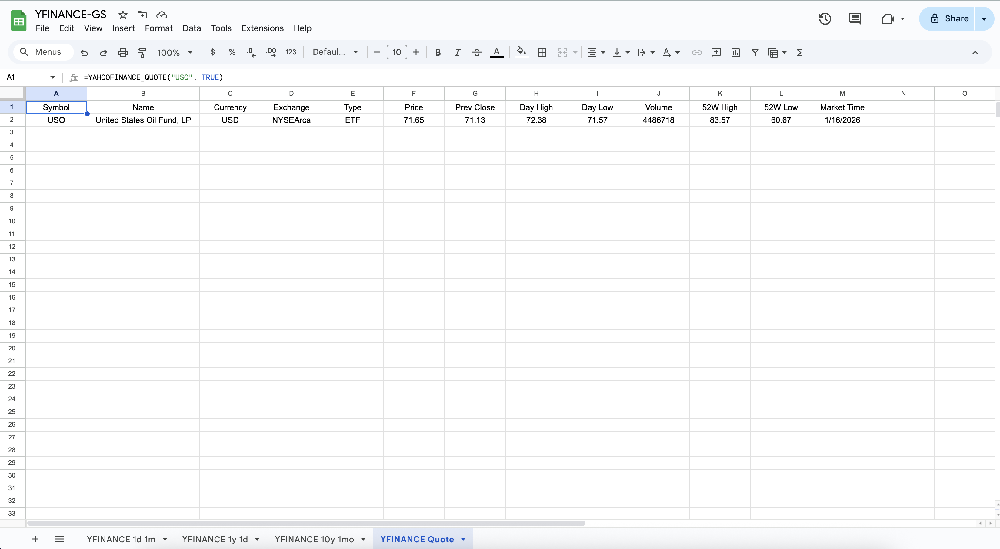

## YFINANCE-GS
 
 A _Google Apps Script_ to fetch financial data from **Yahoo Finance** and store it in **Google Sheets**. 

 ### General Description
 
 Functions very similarly to **GOOGLEFINANCE**1 but uses Yahoo Finance as the data source. The script has limited functionality compared to the **yfinance** Python library2, but it is useful for quick lookups and historical data retrieval directly within Google Sheets. Generally it can be noted, that better alternatives for Yahoo Finance API may exist3,4.

### Features
- Fetches real-time financial data from Yahoo Finance.
- Fetch history data for specified date ranges.
- Stores fetched data in a specified Google Sheets spreadsheet.

### Supported Instruments

| Type | Example Symbols |
|------|-----------------|
| Stocks | AAPL, GOOG, MSFT, TSLA |
| ETFs | SPY, USO, OIH, XOP |
| Indices | ^GSPC (S&P 500), ^DJI (Dow Jones), ^IXIC (NASDAQ), ^RUT (Russell 2000), ^VIX, ^FTSE, ^N225 |
| Futures | GC=F (Gold), CL=F (Crude Oil), ES=F (S&P 500 E-mini), NQ=F (NASDAQ 100) |
| Currencies | EURUSD=X, GBPUSD=X, USDJPY=X |
| Crypto | BTC-USD, ETH-USD, SOL-USD |
| Bonds/Treasuries | ^TNX (10Y Treasury), ^TYX (30Y Treasury) |
| Mutual Funds | VITSX, VFIAX, SWPPX, HFCIX, 0P0001K6O1 |
| Private Companies | SPAX.PVT (SpaceX), OPAI.PVT (OpenAI), DISO.PVT (Discord), PEAI.PVT (Perplexity)|
| Options | NVDA260123C00190000 (NVDA), TSLA260123C00430000 (TSLA) |

### Setup Instructions

1. Open Google Sheets and create a new spreadsheet.
2. Go to `Extensions` > `Apps Script`.
3. Copy and paste the code from the `yfinance.gs` file into the Apps Script editor.
4. Save the script with a name like `YFINANCE`.

### Usage

#### Functions
-----------------------------------------------------------------------

**Returns just the price:**  
_YAHOOFINANCE_PRICE(ticker)_  
=YAHOOFINANCE_PRICE("TCEHY")  
=YAHOOFINANCE_PRICE("^GSPC") → S&P 500 Index  
=YAHOOFINANCE_PRICE("^DJI") → Dow Jones Industrial Average

**Returns a row of key metadata:**  
_YAHOOFINANCE_QUOTE(ticker, [headers])_  
=YAHOOFINANCE_QUOTE("OIH", TRUE)

**Returns latest OHLCV data point:**  
_YAHOOFINANCE_OHLCV(ticker, [headers])_  
=YAHOOFINANCE_OHLCV("USO", TRUE)

**Returns historical OHLCV data:**  
_YAHOOFINANCE_OHLCV_HISTORY(ticker, [headers], [limit])_  
=YAHOOFINANCE_OHLCV_HISTORY("AAPL", TRUE, 10)

**Returns historical OHLCV data with range and interval:**  
_YAHOOFINANCE_OHLCV_HISTORY(ticker, [headers], [limit], [range], [interval])_

=YAHOOFINANCE_OHLCV_HISTORY("JPM", TRUE)   → Today's 1-min data
=YAHOOFINANCE_OHLCV_HISTORY("GOOG", TRUE, 100)   → Last 100 minutes
=YAHOOFINANCE_OHLCV_HISTORY("XOP", TRUE, , "5d", "15m")   → 5 days, 15-min intervals
=YAHOOFINANCE_OHLCV_HISTORY("SPY", TRUE, , "1y", "1d")         → 1 year of daily data
=YAHOOFINANCE_OHLCV_HISTORY("AAPL", TRUE, 52, "1y", "1wk")     → Last year, weekly data

**Valid Ranges & Intervals:** 

|Range	    | Description	  | Recommended Intervals
|-----------|----------------|----------------------
| 1d	    | 1 day	          | 1m, 2m, 5m, 15m, 30m
| 5d	    | 5 days	      | 1m, 5m, 15m, 30m, 1h
| 1mo	    | 1 month	      | 30m, 1h, 1d
| 3mo	    | 3 months	      | 1d
| 6mo	    | 6 months	      | 1d
| 1y	    | 1 year	      | 1d, 1wk
| 2y	    | 2 years	      | 1d, 1wk
| 5y	    | 5 years	      | 1wk, 1mo
| 10y	    | 10 years	      | 1wk, 1mo
| ytd	    | Year to date	  | 1d
| max	    | All available	  | 1wk, 1mo, 3mo

**Returns a specific metadata field	:**  
_YAHOOFINANCE_META(ticker, field)_
=YAHOOFINANCE_META("USO", "52WeekHigh")

#### Returned Columns and Fields
-----------------------------------------------------------------------

_YAHOOFINANCE_QUOTE_ returns columns:
Symbol, Name, Currency, Exchange, Type, Price, Prev Close, Day High, Day Low, Volume, 52W High, 52W Low, Market Time

_YAHOOFINANCE_OHLCV_ returns columns:
Timestamp, Open, High, Low, Close, Volume

_YAHOOFINANCE_META_ supports fields like:
price, name, currency, exchange, type, previousClose, dayHigh, dayLow, volume, 52WeekHigh, 52WeekLow, firstTradeDate, timezone, etc.

## License

MIT License. See LICENSE file for details.

## References
1 [GOOGLEFINANCE function documentation](https://support.google.com/docs/answer/3093281?hl=en)
2 [yfinance Python library](https://pypi.org/project/yfinance/)
3 [A Better Yahoo Finance API Alternative for Developers in 2025](https://dev.to/dollarpixel/a-better-yahoo-finance-api-alternative-for-developers-in-2025-3kn3)
4 [AllTick API](https://alltick.co/)